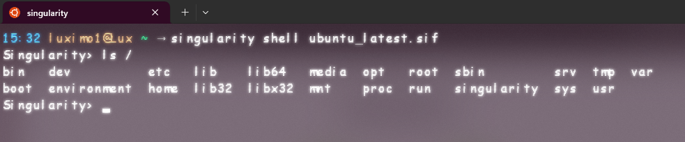
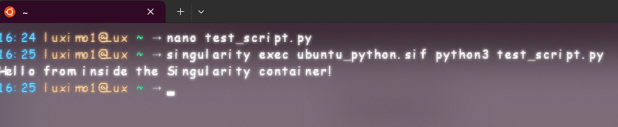

# **Running a trail test on Singularity Container for RNA 3D Folding on HPC (WSU)**
## **Project Overview**
This document provides a **step-by-step guide** on how I set up and tested a **Singularity container** with **Python** and prepared it for deployment on **Wright State University's (WSU) HPC system** using **Slurm**.  

This guide includes:
- **Singularity installation & setup**
- **Running Python inside Singularity**
- **Handling issues like missing Python, read-only filesystems, and shell errors**
- **Transferring our container to WSU's HPC**

---

# **1️⃣ Initial Setup: Installing Singularity**
### **Step 1: Update & Upgrade System**
Before installing Singularity, I updated our system:

```bash
sudo apt update && sudo apt upgrade -y
```

✅ **Success:** System updated successfully.

---

### **Step 2: Install Singularity**
I installed **Singularity** using:

```bash
sudo apt install -y singularity-container
```

✅ **Success:** Singularity installed correctly. I confirmed it with:

```bash
singularity --version
```


**Output:**
```
singularity-ce version 4.1.1
```

---

# **2️⃣ Running Our First Singularity Container**
### **Step 1: Pull an Ubuntu Container**
I downloaded an Ubuntu container image:

```bash
singularity pull library://ubuntu
```


✅ **Success:** The image downloaded successfully.

---

### **Step 2: Enter the Container**
I launched an interactive shell inside the container:

```bash
singularity shell ubuntu_latest.sif
```


To verify, I ran:

```bash
ls /
```


To check the OS inside the container:

```bash
cat /etc/os-release
```


---

# **3️⃣ Checking Python Inside the Container**
### **Step 1: Test if Python is Installed**
I checked if Python was installed:

```bash
python3 --version
```


---

# **4️⃣ Fix: Installing Python Inside Singularity**
### **Attempt 1: Install Python Directly**
I tried:

```bash
apt update && apt install -y python3
```


💡 **Issue:** This means that Singularity runs in **read-only mode**, preventing installations.

---

### **Attempt 2: Use `--writable-tmpfs`**
I exited the container and restarted it with writable permissions:

```bash
type 'exit' to exit the container then enter the command below: 

singularity shell --writable-tmpfs ubuntu_latest.sif
```

Then tried:

```bash
apt update && apt install -y python3
```


💡 **Issue:** Even in `--writable-tmpfs` mode, system-wide installations aren’t allowed inside Singularity.

---

# **5️⃣ Permanent Fix: Building a Custom Singularity Image**
Since I couldn't install Python directly, I created a **custom Singularity container with Python pre-installed**.

### **Step 1: Create a Singularity Definition File**
I exited the container:

```bash
exit
```

Then created a **Singularity definition file** by running the command below:

```bash
nano ubuntu_python.def
```

Then added the following code, save it and exit the editor:

```singularity
Bootstrap: library
From: ubuntu:22.04

%post
    apt update && apt install -y python3 python3-pip
```

---

### **Step 2: Build the Custom Container**

Run the following command to build the custom container:

```bash
sudo singularity build ubuntu_python.sif ubuntu_python.def
```

✅ **Success:** After several installations, the build will complete, be patient...

---

### **Step 3: Verify Python Inside the New Container**
Then enter the custom container:

```bash
singularity shell ubuntu_python.sif
```
Then run the following command to verify that the python is inside the container:

```bash
python3 --version
```


Then tested Python execution:

```bash
python3 -c "print('Hello from Singularity with Python!')"
```


💡 **Issue:** `!` is a **special character** in the shell.

✔️ **Now I need to fix this:** Run this command to try again:

```bash
python3 -c "print('Hello from Singularity with Python\!')"
```


This confirms that the Python interpreter is working properly.

---

# **6️⃣ Running a Python Script Inside Singularity**
### **Step 1: Create a Python Script**
On the **host system**, I created a Python script:

```bash
nano test_script.py
```

Add the following code to your test_script.py file:

```python
print("Hello from inside the Singularity container!")
```

---

### **Step 2: Run the Script Inside Singularity**
Without entering the container, run the following command:

```bash
singularity exec ubuntu_python.sif python3 test_script.py
```



Alternatively, you can do this inside the container:

First, run the following command to enter the custom container:

```bash
singularity shell ubuntu_python.sif
```

then run the following command to run the test_script inside the container:

```bash
python3 test_script.py
```


# **7️⃣ Preparing for HPC Deployment at Wright State University (WSU)**
### **Step 1: Transfer Files to WSU’s HPC**

How do I do this...?
There's no documentation on how to transfer files or connect to WSU HPC or so...
I need to ask Prof KD...

I will be back...😎

## Resources
- [Singularity Quick-Start guide](https://github.com/mkijowski/container-education/tree/master/1_singularity)
